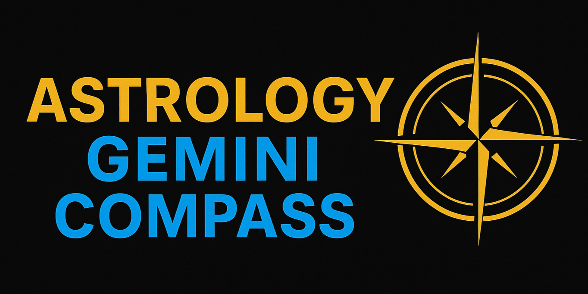

<p align="center">
  
</p>

[English](./README.md) | [中文](./README.zh-tw.md)

This project is a **natal chart calculation and visualization service** built with **FastAPI** + **Swiss Ephemeris (pyswisseph)**.  
The frontend uses **AstroChart.js** to render the chart, displaying planetary positions, house cusps, and aspect tables.  
If a Gemini API key is provided, the system can also generate **AI-powered astrological analysis in Traditional Chinese**.

---

## 🧭 Background
In an era of rapidly changing information, people often feel lost.  
This project seeks to bring the ancient wisdom of Western astrology into the modern age,  
helping people find their own guidance by combining timeless tradition with new technology.

---

## ✨ Features
- Input birth date, time, and place, with automatic latitude/longitude and timezone resolution using Nominatim.  
- Calculate planets, houses, Ascendant, and Midheaven using Swiss Ephemeris.  
- Render natal chart with aspects, planetary degrees, and houses.  
- Tabular outputs: Big 4 planets, element distribution, house emphasis, planetary positions, and aspect table.  
- (Optional) Google Gemini AI: Generates a 400–600 word personality and guidance analysis in Markdown.

---

## ⚙️ Usage

### 1. Install dependencies
```bash
uv sync
```
(This installs all required packages based on `pyproject.toml`.)

### 2. Start the server
```bash
uv run uvicorn main:app --reload
```
By default, the frontend will be available at <http://127.0.0.1:8000>.

### 3. Steps
1. On the homepage, enter **birth date/time and birthplace**.  
2. Click “Calculate” to display:
   - Natal chart (with aspects)  
   - Big 4 planets summary  
   - Element balance and details  
   - House emphasis  
   - Planetary positions  
   - Aspect table  
   - (If enabled) AI-generated astrological advice  
3. Tables are displayed directly; AI analysis and credits are rendered in Markdown.

---

## 🤖 Enable Gemini AI
1. Create a `.env` file in the project root.  
2. Add your API key (replace with your own):  
   ```env
   GEMINI_API_KEY=your_api_key_here
   ```
3. Restart the server.  
4. The `/api/chart` response will include the `ai_advice_md` field, and the frontend will display “AI Chart Analysis”.

---

## 🚀 Run with Docker

This project is published on [Docker Hub](https://hub.docker.com/r/jacob860818/astrology-gemini-compass).  

### Pull the image
```bash
docker pull jacob860818/astrology-gemini-compass:v1.0.0
```

### Run the container
```bash
docker run -d   -e GEMINIAPIKEY=your_api_key_here   -p 8080:8080   jacob860818/astrology-gemini-compass:v1.0.0
```

After starting, open your browser at:  
```bash
http://localhost:8080
```

---

## 🙏 Credits
- Planetary calculations: Swiss Ephemeris (`pyswisseph`)  
- Geocoding: OpenStreetMap / Nominatim  
- Timezone lookup: `timezonefinder` → IANA  
- Time conversion: `pytz` (local → UTC → Julian Day)  
- Chart rendering: `@astrodraw/astrochart` (SVG-based)  
- AI model: Google Gemini 1.5 Flash (enabled only with API key, Markdown output)  
- Reference project: [AllanYiin's Project](https://github.com/AllanYiin/VibeChallenge49/tree/master)  
- Domain knowledge sources: Astrology Door, Prof. Huang Ming’s astrology resources  
