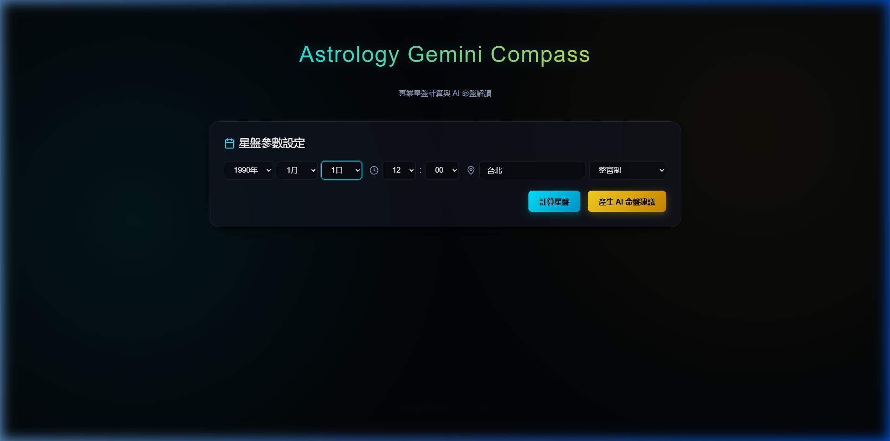

<p align="center">
  
</p>

# Astrology Gemini Compass

[English](./README.md) | [中文](./README.zh-tw.md)

Astrology Gemini Compass is a professional natal chart calculation and RAG-enhanced AI analysis platform. It combines high-precision astronomical calculations with an advanced Retrieval-Augmented Generation (RAG) system to provide insightful, academically-grounded astrological guidance.

---

## ✨ Key Contributions

### 1. Advanced Natal Chart Visualization
This project features a customized implementation of **natal chart rendering**, displaying planet positions, house cusps, and aspect tables with high precision. It transforms raw astronomical data from **Swiss Ephemeris** into an intuitive, SVG-based visual experience.

### 2. RAG-Enhanced AI Analysis (The Core Innovation)
Unlike standard AI chatbots, this system uses **Retrieval-Augmented Generation (RAG)** to "ground" its analysis in professional astrology literature.
- **Knowledge Base**: Uses a local **Qdrant** vector database to store and retrieve chunks from professional astrology guides.
- **Precision**: By retrieving context-specific knowledge, the AI (Gemini 2.5 Flash) provides advice that is far more accurate and professional than generic LLM responses.

#### 🧠 How the RAG Works
The RAG system follows a classic **Ingest -> Retrieve -> Augment** pipeline:
1.  **Data Ingestion (`build_rag.py`)**:
    *   **Loading**: Astrology PDFs and text guides are loaded from the `docs/` directory.
    *   **Splitting**: Content is split into smaller chunks (approx. 700 characters) with overlap to preserve context using `RecursiveCharacterTextSplitter`.
    *   **Embedding**: Each chunk is transformed into a high-dimensional vector (3072 dimensions) using `models/gemini-embedding-001`.
    *   **Storage**: These vectors are stored in a local **Qdrant** collection named `astrology_knowledge`.
2.  **Retrieval & Generation (`main.py`)**:
    *   **Search**: When a user requests an AI analysis, the system embeds the birth chart data (e.g., "Sun in Capricorn") and performs a similarity search against the Qdrant database.
    *   **Context Injection**: The most relevant excerpts from professional astrology books are retrieved.
    *   **Augmentation**: These excerpts are injected into the LLM prompt as "Reference Context".
    *   **Final Output**: Gemini 2.5 Flash synthesizes the birth chart data and the professional context to generate a deeply personalized and academically accurate analysis.

---

## 🚀 Features
- **Natal Chart Visualization**: High-precision rendering of planetary positions and aspects.
  
- **RAG-Enhanced AI Advice**: Expert-level analysis grounded in professional literature.
  
- **Comprehensive Data Tables**: Detailed breakdown of elements, houses, and planetary states.
  

---

## 🛠️ Technical Stack
- **Backend**: FastAPI (Python 3.12, UV for package management)
- **Frontend**: React (Vite)
- **Database**: Qdrant (Local vector store)
- **AI/LLM**: Google Gemini 2.5 Flash + Gemini Embedding 001
- **RAG Framework**: LangChain + Langchain-Qdrant

---

## ⚙️ Local Setup

### 1. Prerequisites
Ensure you have `uv` (Python) and `npm` (Node.js) installed.

### 2. Clone and Install
```bash
# Install backend dependencies
uv sync

# Install frontend dependencies
cd frontend
npm install
```

1. On the homepage, enter **birth date/time and birthplace**.
   
2. Click “Calculate” to display:

### 3. Knowledge Base Setup (Mandatory for RAG)
You must download the astrology knowledge base files and place them in the `docs/` folder:
- [Astrology Guide Part 1](https://drive.google.com/file/d/151KLdRjCkaCwW4eTppCitg8vcQFU_vfd/view?usp=drive_link)
- [Astrology Guide Part 2](https://drive.google.com/file/d/1nSwX_pPxoOLFOeVsR_Q8XFUyBn0tpuQF/view?usp=drive_link)

After downloading, run the indexing script:
```bash
uv run build_rag.py
```

### 4. Environment Configuration
Create a `.env` file in the root:
```env
GEMINI_API_KEY=your_gemini_api_key_here
```

### 5. Running
**Backend:**
```bash
uv run uvicorn main:app --reload
```
**Frontend:**
```bash
cd frontend
npm run dev
```

---

## 🚀 Docker Deployment

### Build the image
```bash
docker build -t astrology-gemini-compass:latest .
```

### Run the container
```bash
docker run -d \
  -p 8000:8000 \
  -e GEMINI_API_KEY=your_api_key_here \
  astrology-gemini-compass:latest
```

---

## 🙏 Credits
- **Planetary Calculations**: Swiss Ephemeris (`pyswisseph`)
- **Geocoding**: OpenStreetMap / Nominatim
- **RAG Knowledge Sources**: Professional Astrology resources (Prof. Huang Ming)
- **Chart Rendering**: `@astrodraw/astrochart`
- **Inspiration**: Specialized Western Astrology calculation patterns.
