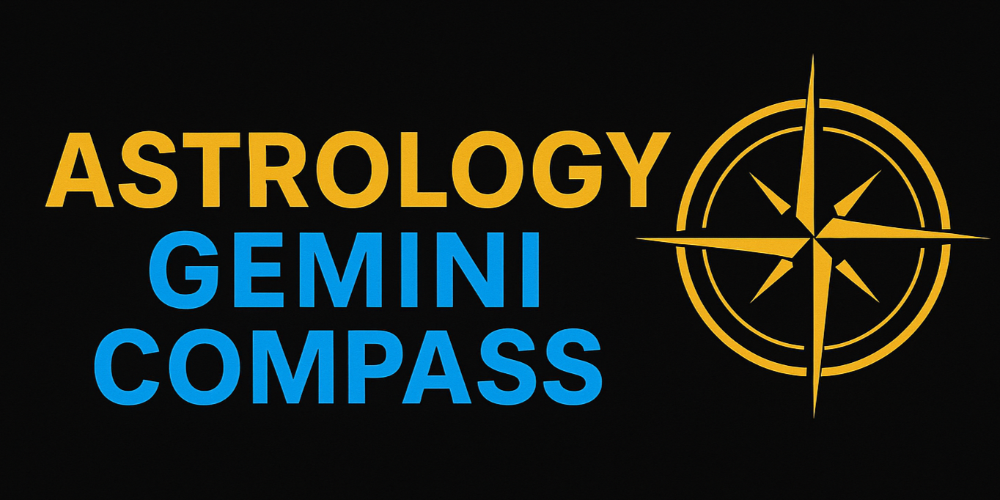
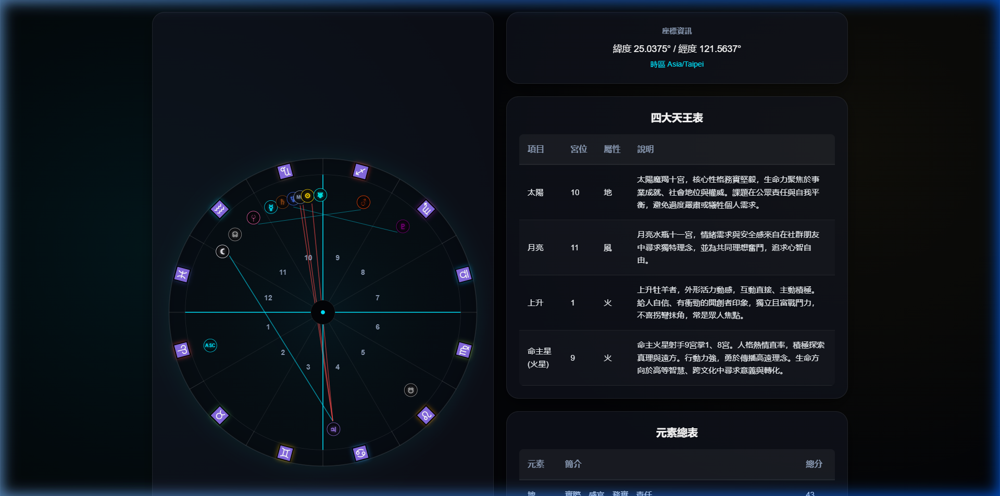
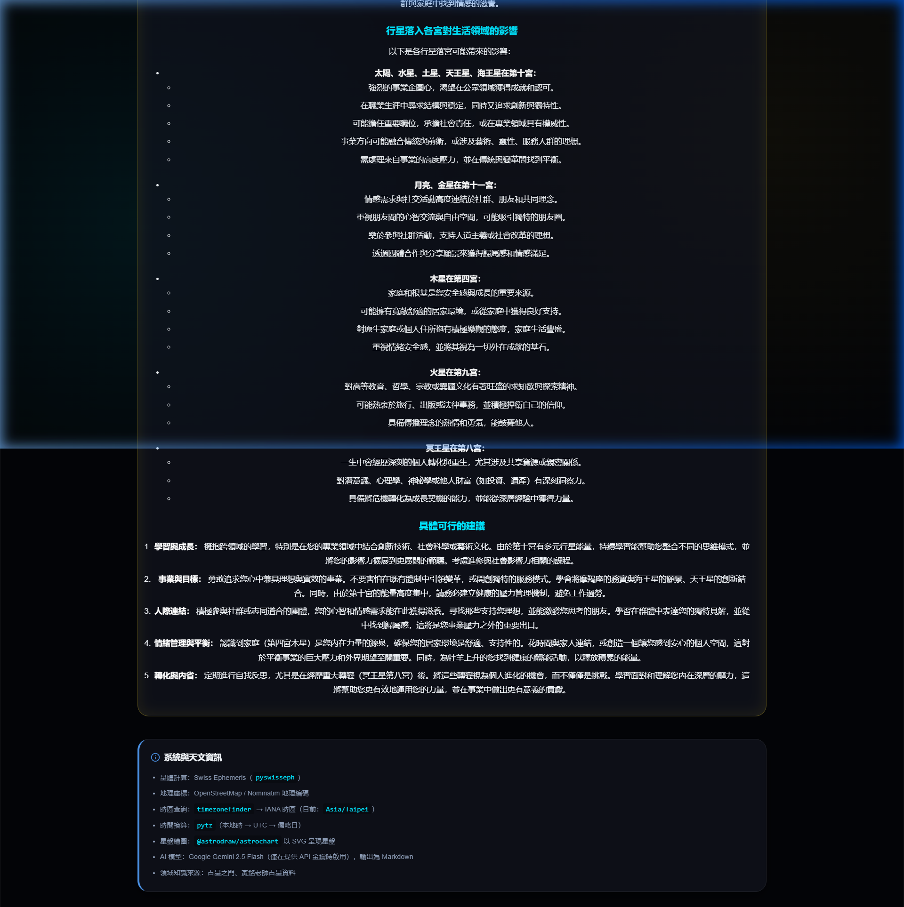
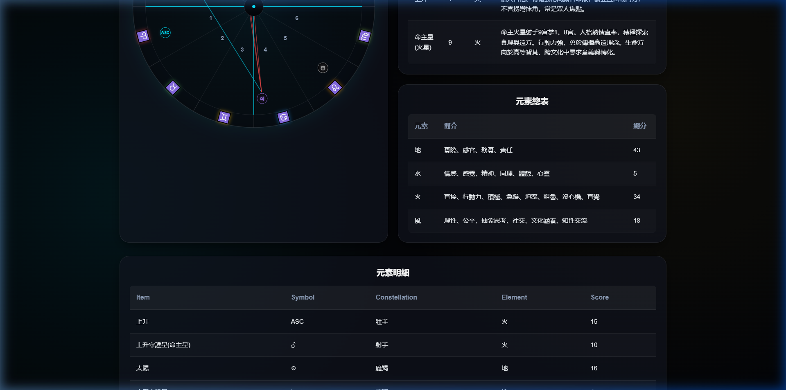

<p align="center">
  
</p>

# Astrology Gemini Compass (占星雙子羅盤)

[English](./README.md) | [中文](./README.zh-tw.md)

Astrology Gemini Compass 是一個專業級的星盤計算與 RAG 增強型 AI 分析平台。它結合了高精度的天文計算與先進的檢索增強生成（RAG）系統，提供具有學理依據的專業占星指引。

---

## ✨ 核心貢獻

### 1. 高精度星盤視覺化
本專案實現了高度客製化的**星盤渲染功能**，能夠精確呈現行星位置、宮位邊界及相位表。我們將 **Swiss Ephemeris** 的原始數據轉化為直觀的 SVG 視覺體驗，讓占星師與愛好者一目了然。

### 2. RAG 增強型 AI 分析 (核心創新)
不同於一般的 AI 聊天機器人，本系統採用 **RAG (Retrieval-Augmented Generation)** 技術，讓 AI 在回答前先「翻閱」專業占星文獻。
- **本地知識庫**：使用 **Qdrant** 向量資料庫儲存專業占星指南的知識碎片。
- **專業度提升**：透過檢索特定情境的占星學理，AI (Gemini 2.5 Flash) 提供的建議比通用型 LLM 更精確、完整且具學術深度。

#### 🧠 RAG 運作原理
本系統的 RAG 運作流程遵循經典的 **知識攝取 (Ingest) -> 檢索 (Retrieve) -> 增強生成 (Augment)** 管道：
1.  **知識攝取 (`build_rag.py`)**：
    *   **讀取**：從 `docs/` 目錄載入占星 PDF 電子書與文本指南。
    *   **切分**：使用 `RecursiveCharacterTextSplitter` 將長文切分為小塊（約 700 字），並包含重疊區塊以保留脈絡。
    *   **向量化**：使用 `models/gemini-embedding-001` 將文字區塊轉換為高維向量（3072 維）。
    *   **存儲**：將向量存入本地 **Qdrant** 資料庫的 `astrology_knowledge` 集合中。
2.  **檢索與生成 (`main.py`)**：
    *   **檢索**：當用戶請求分析時，系統會將星盤關鍵特徵（如「太陽在摩羯座」）轉換為向量，並在 Qdrant 中進行相似度搜尋。
    *   **知識注入**：提取最相關的專業占星書內容。
    *   **增強**：將提取出的專業文獻作為「參考背景」注入給 AI 的 Prompt。
    *   **最終分析**：Gemini 2.5 Flash 結合用戶星盤數據與專業知識庫內容，生成深度、精確且符合占星學理的個性化解析。

---

## 🚀 功能簡介
- **專業星盤繪製**：精確呈現行星位置與複雜相位圖。
  
- **RAG 增強型 AI 建議**：結合專業占星文獻的深度解析。
  
- **詳盡數據表格**：四大天王、元素分佈、宮位強弱等完整分類。
  

---

## 🛠️ 技術棧
- **後端**: FastAPI (Python 3.12, 使用 UV 管理環境)
- **前端**: React (Vite)
- **向量資料庫**: Qdrant (Local Mode)
- **AI 模型**: Google Gemini 2.5 Flash + Gemini Embedding 001
- **開發框架**: LangChain + Langchain-Qdrant

---

## ⚙️ 本地開發環境設置

### 1. 前置需求
請確保您的系統已安裝 `uv` (Python 管理工具) 與 `npm` (Node.js)。

### 2. 安裝與依賴設定
```bash
# 安裝後端依賴
uv sync

# 安裝前端依賴
cd frontend
npm install
```

### 3. 建立知識庫 (RAG 核心步驟)
您需要下載以下占星指南檔案並放置於 `docs/` 資料夾中：
- [占星指南 第一部分](https://drive.google.com/file/d/151KLdRjCkaCwW4eTppCitg8vcQFU_vfd/view?usp=drive_link)
- [占星指南 第二部分](https://drive.google.com/file/d/1nSwX_pPxoOLFOeVsR_Q8XFU_vfd/view?usp=drive_link)

下載完成後，執行索引腳本：
```bash
uv run build_rag.py
```

### 4. 環境變數設定
在專案根目錄建立 `.env` 檔案：
```env
GEMINI_API_KEY=您的_API_金鑰
```

### 5. 啟動程式
**啟動後端:**
```bash
uv run uvicorn main:app --reload
```
**啟動前端:**
```bash
cd frontend
npm run dev
```

---

## 🚀 Docker 部署

### 建立映像 (Image)
```bash
docker build -t astrology-gemini-compass:latest .
```

### 執行容器
```bash
docker run -d \
  -p 8000:8000 \
  -e GEMINI_API_KEY=您的API金鑰 \
  astrology-gemini-compass:latest
```

---

## 🙏 引用與致謝
- **天體計算**: Swiss Ephemeris (`pyswisseph`)
- **地理編碼**: OpenStreetMap / Nominatim
- **RAG 知識來源**: 專業占星文獻（黃銘老師占星資料、占星之門）
- **星盤繪製**: `@astrodraw/astrochart`
- **啟發來源**: 專業西洋占星學理與計算模式。
